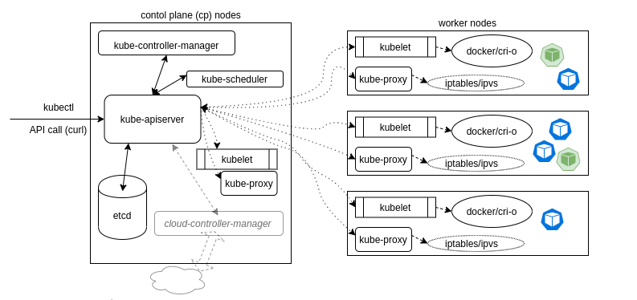
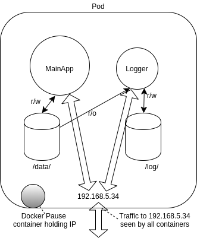
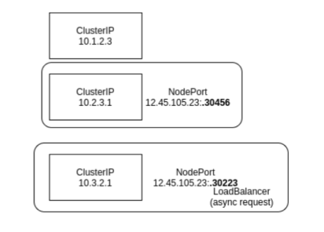
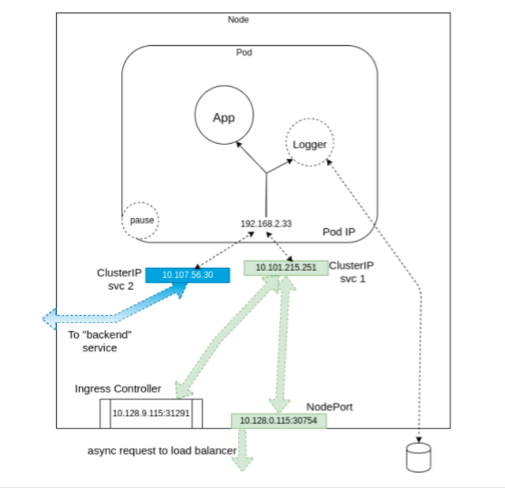
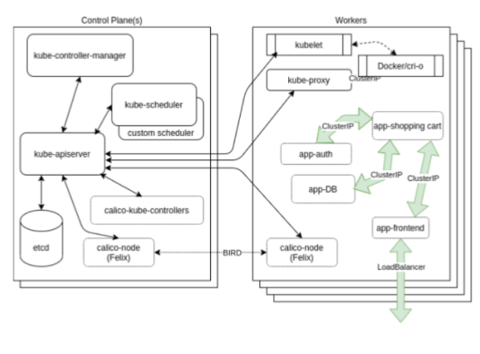

# Kubernetes architecture

Introduction to Kubernetes architecture - it's not directly mapped to the exam curriculum, but it's required to understand some basics about the architecture.

## Objectives

* Learn  common terms related to k8s
* Discuss history of k8s
* Understand what are control plane node components and worker node components
* Learn about Container Network Interface (CNI) configuration and Network Plugin

## What is Kubernetes?

* According to k8s website it's an "open-source system for automating deployment, scaling, and management of containerised applications".
* His precursor is Borg project, developed for 15 years by Google.
* Other definition says that Kubernetes is an orchestration system to deploy and manage containers.
* Kubernetes is written in Go Language

## Challenges

* a need for a CI pipeline to build, test, and verify container images
* a need for an infrastructure to run containers and watch over them when things fail and self-heal.
* an ability to perform rollbacks, rolling updates and tear down resources.

All of those require flexible easy-to-manage network and storage. As containers are lunched on any worker node, the network must join the resource to other existing containers, while still keeping the traffic secure from others. We also need a maintainable storage structure.

## Architecture



Kubernetes in its simplest form is made of:

* one or more central managers(masters).
* one or more worker nodes.

For testing purposes it can be combined to a single node.

The manager runs:

* an API server,
* scheduler,
* operators,
* a datastore to keep the state of the cluster container settings, and the networking configuration.

K8s exposes the API via the API server, which can be reached using local client - `kubectl`.

The kube-scheduler sees the API request for running a new container and finds a suitable node to run that container.

Each node in the cluster runs two containers:

* kubelet, which receives spec information for container configuration, downloads and manages any resources and works with the container engine on the local node to ensure the container runs or is restarted upon failure.
* kube-proxy, creates and manages local firewall rules and networking configuration to expose containers on the network.

Containers in k8s are not managed individually - they are part of a **Pod**. 

A Pod consists at least one container. Containers in a pod share with each other:

* an IP address,
* namespace,
* storage.

Typically one container in a Pod runs an application while other containers support the primary application.

Orchestration is managed through **operators** and **controllers**. Each operator uses the **kube-apiserver** for a particular object state, modifying the object until the declared state matches the current status.

The default operator for container is **Deployment**. A Deployment deploys and manages a different operator called **ReplicaSet** A ReplicaSet is an operator which deploys multiple pods, each with the same spec information. These are called **replicas**.

The Kubernetes architecture is made up of many operators such as:

*  **Jobs** - to handle single task
*  **CronJobs**  - to handle recurring tasks
*  custom resource definitions,
*  purpose-built operators.

Kubernetes provides several API objects which can be used to deploy pods, other than just ensuring a certain number of replicas is running somewhere.

A **DeamonSet** can be used to ensure that a single pod is deployed on every node. These are often used for logging metrics and security pods.

A **StatefulSet** can be used to deploy pods in a particular order, such that following pods are deployed only if previous pod reports a ready status. It can be used for legacy applications which are not cloud-friendly.

To make cluster management easier, we can use **labels** - strings which become part of the object metadata. They can be use when selecting objects, when don't know the pod name. 

Nodes can have **taints**, and arbitrary string in the node metadata, to inform the scheduler on Pod assignments used along with toleration in Pod metadata, indicating it should be scheduled on a node with the particular taint.

There is also space in metadata for **annotations**, which remain with the object, but cannot be used as a selector. However, they could be leveraged by other objects or Pods.

Often multiple users and teams share access to one or more clusters. This is referred as MULTI-TENANCY. Some form of isolation is necessary in this case. It can be achieved by using:

* Namespace 
	- a segregation of resources, upon witch resource quotas and permissions can be applied.
	- K8s objects may be created in a namespace or cluster-scoped. 
	- Users can be limited by the object verbs allowed per namespace. 
	- Also **LimitRange** admission controller constraints resource usage in that namespace. 
	- Two objects cannot have the same name in the same namespace.
* Context 
	- combination of user, cluster name and namespace.
	- a convenient way to switch between combinations of permissions and restrictions. 
	- This information is referenced from `~/.kube/config`.
* Resource Limits 
	- a way to limit resources consumed by a pod.
	- a way to limit minimum amount of resources reserved by a pod. 
	- Limits can also be set per-namespaces, which have priority over those in the PodSpec.
* Pod Security Admission 
	- a beta feature to restrict pod behaviour in an easy-to-implement and easy-to-understand manner.
	- applied at the namespace level when a pod is created. 
	- These will leverage three profiles: Privileged, Baseline, and Restricted policies.
* Network Policies
	- the ability to have an inside-the cluster firewall. 
	- Ingress and Egress traffic can be limited according to namespaces and labels as well as typical network traffic characteristics.
* Pod Security Policies 
 - **Deprecated**
 - It was a policy to limit the ability of pods to elevate permissions or modify the node upon which they are scheduled. 
 - This wide-ranging limitation may prevent a pod from operating properly. 
 - This was replaced with Pod Security Admission. 
 - Some have gone towards Open Policy Agent, or other tools instead.


## Control Plane Nodes

K8s master runs various server and manager processes for the cluster. Among the components of the master node are:

* the kube-apiserver,
* the kube-scheduler,
* the etcd database.

As the software has matured, new components have been created to handle dedicated needs, such as the **cloud-controller-manager**. It handles tasks, to interact with other tools such as Rancher or DigitalOcean for third-party cluster management and reporting.

There are several add-ons which have become essential to a typical production cluster, such as DNS services. Others are third-party solutions where K8s has not yet developed a local component, such as cluster-level logging and resource monitoring.

### Control Plane Node Components

#### kube-apiserver

* Central to the operation of the Kubernetes cluster.
* Handles all calls(internal and external), accepts, and validates them.
* The only agent which connects to the etcd database.
* Acts as a master process for the entire cluster, and as a fronted of the cluster's shared state.
* Each API call goes through three steps: authentication, authorization, and several admission controllers.

#### kube-scheduler

* uses an algorithm to determine which node will host a Pod of containers.
* checks available resources(CPU etc.) to bind, and assign the Pod.
* The scheduler uses pod-count by default but complex config is often done if cluster-wide metrics are collected.

One of the first configurations referenced during creation is if the Pod can be deployed within the current quota restrictions. If so, then the taints and tolerations, and labels of the Pods are used along with those of the nodes to determine the proper placement. Some is done as an admission controller in the kube-apiserver, the rest is done by the chosen scheduler

> **Note**
> 
> More details can be found on [Github](https://github.com/kubernetes/kubernetes/blob/master/pkg/scheduler/scheduler.go)

#### etcd Database

* Keeps the state of the cluster, networking and other persistent information.
* It's a b+tree key-value store.
* Rather than finding and changing an entry, values are always appended to the end, while previous copies of the data are marked for future removal by a compaction process.
* It works with curl and other HTTP libraries, and provides reliable watch queries.

> **Warning**
> 
> Simultaneous requests to update a particular value all travel via the kube-apiserver, which then passes along the request to etcd in a series. The first request would update the database. The second request would no longer have the same version number as found in the object, in which case the kube-apiserver would reply with an error 409 to the requester.

There is a "control plane" database along with possible followers. They communicate with each other on an ongoing basis to determine which will be master, and determine another in the event of failure. While very fast and potentially durable, there have been some hiccups with some features like whole cluster upgrades. The kubeadm cluster creation tool allows easy deployment of a multi-master cluster with stacked etcd or an external database cluster.

#### Other agents

The kube-controller-manager: 
* is a core control loop daemon which interacts with the kube-apiserver to determine the state of the cluster.
* if the state doesn't match, the manager will contact the necessary controller to match the desired state.
* There are several controllers in use, such as endpoints, namespace, and replication.

Remaining in beta as of v1.16, the cloud-controller-manager interacts with agents outside of the cloud. It handles tasks once handled by kube-controller-manager. This allows faster changes without altering the core k8s control process. Each kubelet must use the `--cloud-provider-external` settings passed to the binary.

## Worker nodes

All worker nodes run:

* kubelet
* kube-proxy
* container engine, such as `Docker` or `cir-o`.

Also other management daemons are deployed to watch these agents or provide various services.

**kubelet** 

* interacts with container engine installed on all the nodes,
* makes sure that the containers that need to run are actually running
* The kubelet agent is the heavy lifter for changes and configuration on worker nodes.
* accepts API calls for Pod specifications (a PodSpec is a JSON or YAML file). 
* Should a Pod require access to storage, Secrets or ConfigMaps, the kubelet will ensure access or creation
* sends back status to the kube-apiserver for eventual persistence.

**kube-proxy** 

* is in charge of managing the network connectivity to the containers.It does so through the use of iptables entries. 
* has the user-space mode, in which it monitors Services and Endpoints using a random high-number port to proxy traffic. 
* Use of ipvs can be enabled with the expectation it will become the default, replacing iptables.

K8s doesn't have cluster-wide logging yet. Instead, another CNCF project is used - **Fluentd**. It provides a unified logging layer for the cluster, which filters, buffers, and routes messages.

For cluster-wide metrics, **Prometheus** is often deployed to gather metrics from nodes and some applications. 

## Pods

* Is the smallest unit we can work with. 
* It can contain multiple containers. 
* Cue to shared resources, the design of a Pod typically follows one-process-per-container architecture.


Containers inside the pod start in parallel - it's not possible to determine which one becomes available first. We can use `initContainers` to ensure some containers are ready before others in a pod. 

To support a single process running in the container, we may need logging, a proxy, or special adapter. These tasks are often handled by other containers in the same Pod. There is only one IP address per Pod with most network plugins.

**Sidecar** 

* A container dedicated to performing helper task.
* A common reason for having this is logging.


Pods can be generated using a generator, which historically, has changed with each release:

```bash
kubectl run mypodname --image=apache --generator=run-pod/v1
```

Or they can be created/deleted using properly formatted JSON or YAML file:

```bash
kubectl create -f mypodname.yaml
kubectl delete -f mypodname.yaml
```

Other objects will be created by operators/watch-loops to ensure the specifications and current status are the same.

## Services

* Flexible and scalable operator which connects resources together
* Each Service is a micro-service handling a particular bit of traffic, such as a single **NodePort** or a **LoadBalancer**
* Handles access policies for inbound requests - useful for resource control and security.
* as well as `kubectl`, uses a **selector** in order to know which objects to connect. There are two selectors currently supported:
	- equality-based - can be used as `=`, `==` and `!=`
	- set-based - `in`, `notin` and `exists`

## Operators (also known as watch-loops/controllers)

The use of operators is an important concept for orchestration. 

1. They query the current state,
2. compare it against the spec,
3. execute code based on how they differ. 

They are shipped with k8s, but custom ones could be created as well.

A simplified view of an operator is an `Agent` or `Informer` and a `downstream store`, Using a **DeltaFIFO** queue, the source and downstream are compared. A loop process receives an object, which is an array of deltas from the FIFO queue.

As long as the delta is not of the type **Deleted**, the logic of the operator is used to create or modify some object until it matches the specification.

The Informer uses the API server as a source requests the state of an object via API call. The data is cached to minimise API server transactions. A similar agent is the **SharedInformer**; objects are often used by multiple other objects. It creates a shared cache of the state for multiple requests.

A **Workqueue** uses a key to hand out tasks to various workers. The standard Go workqueues of:

* rate limiting, 
* delayed, 
* and time queue,

are typically used.

The `endpoints`, `namespace` and `serviceaccounts` operators each manage the resources for Pods.

## Single IP per Pod

The diagram below shows a pod with two containers:

* MainApp,
* Logger, 

and two data volumes, made available under two mount points.

Both Containers share the network namespace of a third container, know as the **pause container**. 

The pause container is used to get an IP address.Then all the containers in the pod will use its network namespace. This container is not visible from k8s perspective, but it can be seen by running `sudo docker ps`.



To communicate with each other, containers can:

* use the loopback interface, 
* write to files on a common filesystem
* use inter-process communication (IPC). 

As a result, co-locating applications in the same pod may have issues. Support for `dual-stack`, IPv4 and IPv6 increases with each `kube-proxy` release. 

## Networking Setup

> **Note**
> 
> A detailed explanation about the k8s networking model can be found in the [Cluster Networking](https://kubernetes.io/docs/concepts/cluster-administration/networking/) section of k8s documentation.

From a network perspective, a Pod can be seen as a virtual machine of physical host. The network needs to assign IP addresses to Pods, and needs to provide traffic routes between all Pods on any nodes.

The main networking challenges to solve in a container orchestration system are:

* Coupled Container2Container communications (this is actually solved by the Pod concept)
* Pod2Pod communications
* External2Pod communications

K8s expects the network configuration to enable Pod2Pod. It will not do it for us.

Pods get an IP address assigned prior to application containers being started. 

The service object is used to connect Pods:

 * within the network using `ClusterIP` addresses, 
 * from outside of the cluster using `NodePort` addresses, and using a load balancer if configured with a `LoadBalancer` service.

### ClusterIP



A ClusterIP is used for traffic **within the cluster**. 

A NodePort first creates a ClusterIP, then associates a port of the node to that new ClusterIP. 

If we create a LoadBalancer service, it will first create a ClusterIP, then a NodePort, and then make an async request for an external load balancer. If one is not configured to respond, the `EXTERNAL-IP` will remain in a `pending` state for the life of the service.

### Kubernetes service flow



An **Ingress Controller** or a service mesh like **Istio** can also be used to connect traffic to a Pod. 

This diagram shows a multi-container Pod, two services with one for internal traffic only, and an ingress controller. 

The sidecar container, acting as a logger, is shown writing out storage, just to show a more complete Pod. The pause container is only used to retrieve the namespace and IP addresses.

### Another example



Another possible view of a cluster with multiple Pods and services can be seen in this graphic. The diagram shows the Calico Pod running on each node and communicating with a BIRD protocol. 

There are also three ClusterIP services and a LoadBalancer service trying to show how the frontend may communicate with other Pods. The Pods could have been on any worker, and are shown on one only as an example.

Note that this graphic is not an expansion of the previous one.

> **Note**
>
>Useful slide deck about Kubernetes networking, created by Tim Hockin - one of the lead k8s developers, can be found [here](https://speakerdeck.com/thockin/illustrated-guide-to-kubernetes-networking)


## API Call Flow


1. API Call(for example to create deployment via `kubectl`) to `kube-apiserver`
2. `kube-apiserver` sends the information about a new deployment request to `etcd`
3. A moment later `kube-controller-manager checks` with `kube-apiserver` if the spec has changed(it changed in the previous point)
4. `kube-controller-manager` asks `kube-api-server` if the deployment exists (it doesn't exist)
5. `kube-controller-manager` asks `kube-api-server` to create the deployment
6. `kube-apiserver` creates the deployment - it persists the information about new deployment in `etcd` database
7.  New deployment operator requests `kube-controller-manager` via `kube-apiserver` for a replica set, following the same process.
8.  New replicaset operator requests `kube-controller-manager` via `kube-apiserver` for a pod, following the same process 
9. `kube-apiserver` asks `kube-scheduler`, which of the available worker nodes should get sent this new pod spec
10. `kube-scheduler` returns information to `kube-apiserver` on which node the pod should be created.
11. `kube-apiserver` sends the information to the particular `kubelet` on worker node. It also sends a networking information to each of the `kube-proxies`, so they are aware of the new networking configuration(even to the local `kube-proxy` on control plane nodes)
12. `kubelet` downloads all the config maps, secrets, mounts filesystems etc.
13. `kubelet` sends the message to local engine(usually `docker`)
14. `docker` creates containers
15. `docker` sends back information to `kubelet` about created containers
16. `kubelet` sends back information to `kube-apiserver` about created pod
17. `kube-apiserver` persists information about the pod in `etcd` database

Then the next time that a request is made by the `kube-controller-manager` about the status, it's able to update it, and says the pod exists. All the watch-loops continue asking: "What's my spec, and what's my status? Do they match?"

## CNI Network Configuration file

To provide container networking, Kubernetes is standardising on the **Container Network Interface(CNI)** specification. As of v1.6.0, `kubeadm` (the k8s bootstrapping tool) uses CNI as the default network interface mechanism.

CNI is an emerging specification with associated libraries to write plugins that configure container networking and remove allocated resources when the container is deleted. 

Its aim is to provide a common interface between various networking solutions and container runtimes. As the CNI specification is language-agnostic, there are many plugins from Amazon ECS, Cloud Foundry etc.

With CNI, we can write a network configuration file:

```yaml
{
   "cniVersion": "0.2.0",
   "name": "mynet",
   "type": "bridge",
   "bridge": "cni0",
   "isGateway": true,
   "ipMasq": true,
   "ipam": {
       "type": "host-local",
       "subnet": "10.22.0.0/16",
       "routes": [
           { "dst": "0.0.0.0/0" }
            ]
   }
}
```

This config defines a standard Linux bridge named `cni0`, which will give out IP addresses in the subnet `10.22.0.0./16`. The bridge plugin will configure the network interfaces in the correct namespaces to define the container network properly.

> **Note**
> 
> More information about CNI can be find in the [CNI README](https://github.com/containernetworking/cni)

## Pod-to-Pod Communication

While a CNI plugin can be used to configure the network of a pod and provide a single IP per pod, CNI does not help us with pod-to-pod communication across nodes.

The early requirement for k8s was the following:

* All pods can communicate with each other across nodes.
* All nodes can communicate with all pods.
* No Network Address Translation (NAT)

Basically, all IPs involved (nods and pods) are routable without NAT. This can be achieved at the physical network infrastructure if we have access to it(e.g. GKE). Or, this can be achieved with a software defined overlay with solutions like: [Weave](https://www.weave.works/oss/net/), [Flannel](https://docs.openshift.com/container-platform/3.4/architecture/additional_concepts/flannel.html), [Calico](https://www.tigera.io/tigera-products/calico/), [Cilium](https://cilium.io/).

Most network plugins now support the use of Network Policies, which act as an internal firewall, limiting ingress and egress traffic.

> **Note**
>
> For more information see the [Cluster Networking](https://kubernetes.io/docs/concepts/cluster-administration/networking/) Documentation page or the list of [networking add-ons](https://kubernetes.io/docs/concepts/cluster-administration/addons/).


## Resources

* [Large-Scale Cluster Management at Google with Borg" paper](https://ai.google/research/pubs/pub43438)
* [John Wilkes talking about Borg and Kubernetes podcast](https://www.gcppodcast.com/post/episode-46-borg-and-k8s-with-john-wilkes/)
* [Kubernetes community hangouts](https://github.com/kubernetes/community)
* [Community on Slack(go to the #kubernetes-users channel)](http://slack.kubernetes.io/)
* [Stack Overflow community](https://stackoverflow.com/search?q=kubernetes)
