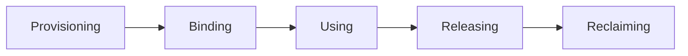

# Application Deployment (20%)

## Objectives

* Use Kubernetes primitives to implement common deployment strategies( e.g. blue/green or canary)
* Understand Deployments and how to perform rolling updates
* Use the Helm package manager to deploy existing packages

# Deployment Configuration

## Objectives

* Understand and create persistent volumes
* Configure persistent volume claims
* Manage volume access modes
* Deploy an application with access to persistent storage
* Discuss the dynamic provisioning of storage
* Configure secrets and ConfigMaps
* Update a deployed application
* Roll back to previous version

## Volumes

Containers engines have traditionally not offered stoarage that outlives container. A K8s volume shares at least the Pod lifetime, not the containers within. Should a container terminate, the data would continue to be available to the new container. A volume can persist longer than a Pod, and can be accessed by multiple Pods using **PersistentVolumeClaims**. This allows for state persistency.

A volume is a directory made avaliable to containers in a Pod. As of 1.14, there were 28 different volume types ranging from `rbd` for Ceph, to `NFS`, to dynamic volumes from a cloud provider like Google's `gcePersistentDisk`. Each has particular configuration options and dependencies.

Should we want our storage lifetime to be distinct from a Pod, we can use Persistent Volumes. These allow for empty or pre-populated volumes to be claimed by a Pod using a Persistent Volume Claim, then outlive the Pod.

There are two API Objects which exists to provide data to a Pod already. Encoded data can be passed using a Secret and non-encoded data can be passed with a **ConfigMap**. These can be used to pass important data like SSH keys, passwords, or even a config gile like `etc/hosts`.

We should be aware that any capacity mentioned does not represent an actual limit on the amount of space a container can consume. Should a volume have a capacity of 10G, that does not mean there is 10G of backend storage available. If there is more and an application were to continue to write it, there is no block on how much space is used, with the possibleexception of a newer limit on ephemeral storage usage. A new CSI driver has become available, so at least we can track actual usage.

### Volume Spec

One of the many types of storage available is an `emptyDir`. The kubelet will create the directory in the container, but not mount any storage. Any data created is written to the shared container space. As a result, it would not be persistent storage. When the Pod is destroyed, the directory would be deleted along with the container.

```
apiVersion: v1
kind: Pod
metadata:
    name: busybox
    namespace: default
spec:
    containers:
    - image: busybox
      name: busy
      command:
        - sleep
        - "3600"
      volumeMounts:
      - mountPath: /scratch
        name: scratch-volume
    volumes:
    - name: scratch-volume
            emptyDir: {}

```

The YAML file above would create a Pod with a single container with a volume named `scratch-volume` created, which would create the `/scratch` directory inside the container.

### Volume Types

#### GCEpersistentDisk and awsElasticBlockStore

In GCE or AWS we can use volumes of type `GCEpersistentDisk` or `awsElasticBlockStore` which allows us to mount GCE and EBS disks in our Pods, assuming we have already set up accounts and privileges.

#### emptyDir and hostPath

`emptyDir` and `hostPath` volumes are easy to use. As mentioned, `emptyDir` is an empty directory that gets erased when the Pod dies, but is recreated when the container restarts. `hostPath` volume mounts a resource from the host node filesystem. The resource could be a directory, file socket, character, or block device. These resources must already exist on the host to be used. There are two types, `DirectoryOrCreate` and `FileOrCreate` which create the resources on the host, and use them if they don't already exist.

#### NFS and iSCSI

`NFS`(Network File System) and `iSCSI`(Internet Small Computer System Interface) are straightforward choices for multiple readers scenarios.

#### rbd, CephFS and GlusterFS

`rbd` for block storage or `CephFS` and `GlusterFS` if available in our k8s cluster, can be a good choice for multiple writer needs

#### Other Volume types

* `azureDisk`
* `azureFile`
* `csi`
* `downwardAPI`
* `fc` (fibre channel)
* `flocker`
* `gitRepo`
* `local`
* `projected`
* `portworxVolume`
* `quobyte`
* `scaleIO`
* `secret`
* `storageos`
* `vsphereVolume`
* `persistentVolumeClaim`
* ...

### Shared Volume Example

The following YAML file, for Pod ExampleA creates a Pod with two containers, one called alphacont, the other called betacont both with access to a shared volume called sharedvol:

```
  containers:
   - name: alphacont
     image: busybox
     volumeMounts:
     - mountPath: /alphadir
       name: sharevol
   - name: betacont
     image: busybox
     volumeMounts:
     - mountPath: /betadir
       name: sharevol
   volumes:
   - name: sharevol
     emptyDir: {}   
```

```
$ kubectl exec -ti exampleA -c betacont -- touch /betadir/foobar
$ kubectl exec -ti exampleA -c alphacont -- ls -l /alphadir

total 0
-rw-r--r-- 1 root root 0 Nov 19 16:26 foobar

```

We can use `emptyDir` or `hostPath` easily - they don't require any additional setup. Note that one container wrote, and the other container had immediate access to the data. There is nothing to keep the containers from overwriting the other's data. Locking or versioning considerations must be part of the application to avoid corruption.

### Persistent Volumes and Claims

A `PersistentVolume`(PV) is a storage abstraction used to retain data longer than the Pod using it. Pods define a volume of type `PersistentVolumeCLaim`(PVC) with various parameters for size and possibly the type of backend storage known as its `StorageClass`. The cluster then attaches the `PersistentVolume`.

K8s will dynamically use volumes that are available, irrespective of its storage type, allowing claims to any backend storage.

```
kubectl get pv
kubectl get pvc
```

### Phases to Persistent Storage



#### Provisioning

Provisioning can be from `PersistentVolumes` created in advance by the cluster administrator, or requested from a dynamic source, such as a cloud provider.

#### Binding

Occurs when a control loop on the master notices the `PersistentVolumeClaim`, containing an amount of storage, access request, and optionally, a particular `StorageClass`. The watcher locates a matching `PersistentVolume` or waits for the `StorageClass` provisioner to create one. The `PersistentVolume` must match at least the storage amount requested, but may provide more.

#### Using

This phase begins when the bound volume is mounted for the Pod to use, which continues as long as the Pod requires.

#### Releasing

Releasing is done when the Pod is done with the volume and an API request is sent, deleting the `PersistentVolumeClaim`. The volume remains in the state from when the claim is deleted until available to a new claim. The resient data remains depending on the `persistentVolumeReclaimPolicy`

#### Reclaiming

The reclaim phase has three options:

* **Retain**, which keep the data intact, allowing for an administrator to handle the storage and data.
* **Delete** tells volume plugin to delete the API object, as well as the storage behind it.
* The **Recycle** option runs an `rm -rf /mountpoint` and then makes it available to a new claim. With the stability of dynamic provisioning, the Recycle option is planned to be deprecated.

### Persistent Volume

The following example shows a basic declaration of `PersistentVolume` using `hostPath` type.

```
kind: PersistentVolume
apiVersion: v1
metadata:
name: 10Gpv01
labels:
type: local
spec:
capacity:
        storage: 10Gi
    accessModes:
        - ReadWriteOnce
    hostPath:
        path: "/somepath/data01"

```

Each type will have its own configuration settings. For example, an already created Ceph or GCE Persistent Disk would not need to be configured, but could be claimed from the provider.

Persistent volumes are cluster-scoped, but persistent volume claims are namespace-scoped. An alpha feature since v1.11 this allows for static provisioning of Raw Block Volumes, which currently support the Fibre Channel plugin. There is a lot of development and change in this area, with plugins adding dynamic provisioning.


### Persistent Volume Claim

With a persistent volume created in the cluster, we can then write a manifest for a claim and use that claim in our pod definition. In the Pod, the volume uses the `PersistentVolumeClaim`.

```
kind: PersistentVolumeClaim
apiVersion: v1
metadata:
    name: myclaim
spec:
    accessModes:
        - ReadWriteOnce
    resources:
        requests:
                storage: 8GI

```

and in the Pod:

```
....
spec:
    containers:
....
    volumes:
        - name: test-volume
          persistentVolumeClaim:
                claimName: myclaim
```

### Dynamic Provisioning

While handling volumes with a persistent volume definition and abstracting the storage provider using a claim is powerful, a cluster administrator still needs to create those volumes in the first place. Starting with k8s v1.4, Dynamic Provisioning allowed for the cluster to request storage from an exterior, pre-configured source. API calls made by the appropriate plugin allow for a wide range of dynamic storage use.

The `StorageClass` API resource allows an administrator to define a persistent volume provisioner of a certain type, passing storage-specific parameters.

With a `StorageClass` created, a user can request a claim, which the API Server fills via auto-provisioning. The resource will also be reclaimed as configured by the provider. AWS and GCE are common choices for dynamic storage, but other options exists, such as a Ceph cluster or iSCSI. Single, default class is possible via annotation.

An example of a `StorageClass` using GCE:

```
apiVersion: storage.k8s.io/v1        
kind: StorageClass
metadata:
  name: fast                         # Could be any name
provisioner: kubernetes.io/gce-pd
parameters:
  type: pd-ssd 

```

## Secrets

Secrets are for data we don't want to be readable by the naked eye, like passwords etc.

`kubectl get secrets`
`kubectl create secret generic --help`
`kubectl create secret generic mysql --from-literal=password=root`

A secret is not encrypted by default, only base64-encoded. We can see the encoded string iside the secret with kubectl. The secret will be decoded and be presented as a string saved to a file. The file can be used as an environmental variable or in a new directory, similar to the presentation of a volume.

In order to encrypt secrets we must create an `EncryptionConfiguration` object with a key and proper identity. Then the `kube-apiserver` needs the `--encryption-provider-config` flag set to a previously configured provider, such as `aescbc` or `ksm`. Once this is enabled, we need to recreate every secret as they are encrypted upon write. Multiple keys are possible. Each key for a provider is tried during decryption oprocess. The fist key of the first provider is used for encryption. To rotate keys, first create a new key, restart (all) `kube-apiserver` processes, then recreate every secret.

```
$ echo LFTr@1n | base64
TEZUckAxbgo=

$ vim secret.yaml
apiVersion: v1
kind: Secret
metadata:
  name: LF-secret
data:
  password: TEZUckAxbgo=

```

Prior to Kubernetes v1.18 secrets (and configMaps) were automatically updated. This could lead to issues. If a configuration was updated and a Pod restarted, it may be configured differently than other replicas. In newer versions these objects can be made immutable.

### Using Secrets via Environment Variables

A secret can be used as an environmental variable in a Pod. Here is an example:

```
...
spec:
    containers:
    - image: mysql:5.5
      name: mysql
      env:
      - name: MYSQL_ROOT_PASSWORD
        valueFrom:
          secretKeyRef:
            name: mysql
            key: password

```

There is no limit to the number of Secrets used, but there is a 1MB limit to their size. Secrets are stored in the `tmpfs` storage on the host node, and are only sent to the host running Pod. All volumes requested by a Pod must be mounted before the containers within the Pod are started. So, a secret must exist prior to being requested.

### Mounting Secrets as Volumes

We can also mount secrets as files using a volume definition in a Pod manifest. The mount path will contain a file whose name will be the key of the secret created with the `kubectl create secret` step eariler.

```
...
spec:
    containers:
    - image: busybox
      name: busy
      command:
        - sleep
        - "3600"
      volumeMounts:
      - mountPath: /mysqlpassword
        name: mysql
    volumes:
    - name: mysql
      secret:
        secretName: mysql
```

Once the pod is running, we can verify that the secret is accessible in the container:

```
$ kubectl exec -ti busybox -- cat /mysqlpassword/password
LFTr@1n
```

## Portable Data with ConfigMaps

