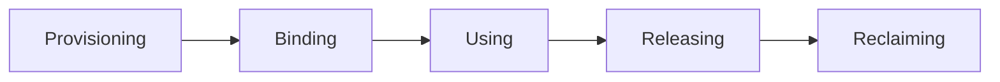

# Application Deployment (20%)

## Objectives

* Use Kubernetes primitives to implement common deployment strategies( e.g. blue/green or canary)
* Understand Deployments and how to perform rolling updates
* Use the Helm package manager to deploy existing packages

# Deployment Configuration

## Objectives

* Understand and create persistent volumes
* Configure persistent volume claims
* Manage volume access modes
* Deploy an application with access to persistent storage
* Discuss the dynamic provisioning of storage
* Configure secrets and ConfigMaps
* Update a deployed application
* Roll back to previous version

## Volumes

* A volume is a directory made avaliable to containers in a Pod
* As of 1.14, there were 28 different volume type
* Traditionally container engines do not offered storage that outlives container.
* k8s volumes live at least the same time as Pod(not the containers).
* If data should be persisted for longer period, we need to use **PersistentVolumeClaims**. This allows for state persistency.
* If we want our storage lifetime to be distinct from a Pod, we can use **Persistent Volumes**. These allow for empty or pre-populated volumes to be claimed by a Pod using a Persistent Volume Claim, then outlive the Pod.


There are two API Objects which exists to provide data to a Pod already:

* Encoded data can be passed using a Secret 

* non-encoded data can be passed with a **ConfigMap**. 

  

These can be used to pass important data like SSH keys, passwords, or even a config gile like `etc/hosts`.


If we define a volume with declared capacity 5G(5Gigabytes):

* It doesn't mean the container can cosume 5G of data.
* It doesn' mean there is 5G available
* If there is more data available, application can continue to write it - there is no block on how much space is used.
* A new CSI driver has become available, so at least we can track actual usage.


### Volume Spec

One of the many types of storage available is an `emptyDir`. The kubelet will create the directory in the container, but not mount any storage. Any data created is written to the shared container space. As a result, it would not be persistent storage. When the Pod is destroyed, the directory would be deleted along with the container.

```yaml
apiVersion: v1
kind: Pod
metadata:
    name: busybox
    namespace: default
spec:
    containers:
    - image: busybox
      name: busy
      command:
        - sleep
        - "3600"
      volumeMounts:
      - mountPath: /scratch
        name: scratch-volume
    volumes:
    - name: scratch-volume
            emptyDir: {}

```

The YAML file above:

*  would create a Pod with a single container,
* with a volume named `scratch-volume` created, 
* which would create the `/scratch` directory inside the container.


### Volume Types

| **Volume Type**                     | **Description**                                              |
| ----------------------------------- | ------------------------------------------------------------ |
| **emptyDir**,                       | `emptyDir` is an empty directory that gets erased when the Pod dies, but is recreated when the container restarts. |
| **hostPath**                        | `hostPath` volume mounts a resource from the host node filesystem. The resource could be a directory, file socket, character, or block device. These resources must already exist on the host to be used. There are two types, `DirectoryOrCreate` and `FileOrCreate` which create the resources on the host, and use them if they don't already exist. |
| **NFS**,  **iSCSI**                 | `NFS`(Network File System) and `iSCSI`(Internet Small Computer System Interface) are straightforward choices for multiple readers scenarios. |
| **rbd**, **CephFS** , **GlusterFS** | `rbd` for block storage or `CephFS` and `GlusterFS` if available in our k8s cluster, can be a good choice for multiple writer needs |

#### Other Volume types

`GCEpersistentDisk`, `azureDisk`, `azureFile`, `csi`, `downwardAPI`, `fc` (fibre channel), `flocker`, `gitRepo`, `local`, `projected`, `portworxVolume`,`quobyte`, `scaleIO`, `secret`, `storageos`, `vsphereVolume`, `persistentVolumeClaim`, ...

### Shared Volume Example

The following YAML file, for Pod ExampleA creates a Pod with two containers, one called alphacont, the other called betacont both with access to a shared volume called sharedvol:

```yaml
  containers:
   - name: alphacont
     image: busybox
     volumeMounts:
     - mountPath: /alphadir
       name: sharevol
   - name: betacont
     image: busybox
     volumeMounts:
     - mountPath: /betadir
       name: sharevol
   volumes:
   - name: sharevol
     emptyDir: {}   
```

```bash
$ kubectl exec -ti exampleA -c betacont -- touch /betadir/foobar
$ kubectl exec -ti exampleA -c alphacont -- ls -l /alphadir

total 0
-rw-r--r-- 1 root root 0 Nov 19 16:26 foobar

```

`emptyDir` and `hostPath` don't require any additional setup. 

After one container wrote, the other had immediate access to the data. They can overwrite the other's data.

### Persistent Volumes and Claims

A `PersistentVolume`(PV) is a storage abstraction used to retain data longer than the Pod using it. Pods define a volume of type `PersistentVolumeClaim`(PVC) with various parameters for size and possibly the type of backend storage known as its `StorageClass`. The cluster then attaches the `PersistentVolume`.

K8s will dynamically use volumes that are available, irrespective of its storage type, allowing claims to any backend storage.

```bash
kubectl get pv
kubectl get pvc
```

### Phases to Persistent Storage



| **Phase**    | **Description**                                              |
| ------------ | ------------------------------------------------------------ |
| Provisioning | Provisioning can be from `PersistentVolumes` created in advance by the cluster administrator, or requested from a dynamic source, such as a cloud provider. |
| Binding      | Occurs when a control loop on the master notices the `PersistentVolumeClaim`, containing an amount of storage, access request, and optionally, a particular `StorageClass`. The watcher locates a matching `PersistentVolume` or waits for the `StorageClass` provisioner to create one. The `PersistentVolume` must match at least the storage amount requested, but may provide more. |
| Using        | This phase begins when the bound volume is mounted for the Pod to use, which continues as long as the Pod requires. |
| Releasing    | Releasing is done when the Pod is done with the volume and an API request is sent, deleting the `PersistentVolumeClaim`. The volume remains in the state from when the claim is deleted until available to a new claim. The resient data remains depending on the `persistentVolumeReclaimPolicy` |
| Reclaiming   | The reclaim phase has three options: 1. **Retain,** which keep the data intact, allowing for an administrator to handle the storage and data. 2. **Delete**, tells volume plugin to delete the API object, as well as the storage behind it. 3. **Recycle**, runs an `rm -rf /mountpoint` and then makes it available to a new claim. With the stability of dynamic provisioning, the Recycle option is planned to be deprecated. |

### Persistent Volume

The following example shows a basic declaration of `PersistentVolume` using `hostPath` type.

```yaml
kind: PersistentVolume
apiVersion: v1
metadata:
	name: 10Gpv01
labels:
	type: local
spec:
	capacity:
    storage: 10Gi
    accessModes:
        - ReadWriteOnce
    hostPath:
        path: "/somepath/data01"

```

Each type will have its own configuration settings. For example, an already created Ceph or GCE Persistent Disk would not need to be configured, but could be claimed from the provider.

* **Persistent volumes** are cluster-scoped,
* **Persistent volume claims** are **namespace-scoped**.


### Persistent Volume Claim

With a persistent volume created in the cluster, we can then write a manifest for a claim and use that claim in our pod definition. In the Pod, the volume uses the `PersistentVolumeClaim`.

```yaml
kind: PersistentVolumeClaim
apiVersion: v1
metadata:
    name: myclaim
spec:
    accessModes:
        - ReadWriteOnce
    resources:
        requests:
                storage: 8GI

```

and in the Pod:

```yaml
....
spec:
    containers:
....
    volumes:
        - name: test-volume
          persistentVolumeClaim:
                claimName: myclaim
```

### Dynamic Provisioning

Claiming a Volume is powerful, but a cluster administrator still needs to create those volumes in the first place.

Starting with k8s v1.4, Dynamic Provisioning allowed for the cluster to request storage from an exterior, pre-configured source. 

The `StorageClass` API resource allows an administrator to define a persistent volume provisioner of a certain type, passing storage-specific parameters.

With a `StorageClass` created, a user can request a claim, which the API Server fills via auto-provisioning. The resource will also be reclaimed as configured by the provider. AWS and GCE are common choices for dynamic storage, but other options exists, such as a Ceph cluster or iSCSI. Single, default class is possible via annotation.

An example of a `StorageClass` using GCE:

```yaml
apiVersion: storage.k8s.io/v1        
kind: StorageClass
metadata:
  name: fast                         # Could be any name
provisioner: kubernetes.io/gce-pd
parameters:
  type: pd-ssd 

```

## Secrets

Secrets are for data we don't want to be readable by the naked eye, like passwords etc.

`kubectl get secrets`
`kubectl create secret generic --help`
`kubectl create secret generic mysql --from-literal=password=root`

* A secret is not encrypted by default, only base64-encoded,
* the encoded string can be seen inside the secret with kubectl,
* the secret will be decoded and be presented as a string saved to a file,
* the file can be used as for example, an environmental variable.

In order to encrypt secrets we must create an `EncryptionConfiguration` object with a key and proper identity. Then the `kube-apiserver` needs the `--encryption-provider-config` flag set to a previously configured provider, such as `aescbc` or `ksm`. Once this is enabled, we need to recreate every secret as they are encrypted upon write. Multiple keys are possible. Each key for a provider is tried during decryption oprocess. The first key of the first provider is used for encryption.

To rotate keys:

1. create a new key,
2.  restart (all) `kube-apiserver` processes,
3.  recreate every secret.


```
$ echo LFTr@1n | base64
TEZUckAxbgo=

$ vim secret.yaml
apiVersion: v1
kind: Secret
metadata:
  name: LF-secret
data:
  password: TEZUckAxbgo=

```

Prior to Kubernetes v1.18 secrets (and configMaps) were automatically updated. This could lead to issues. If a configuration was updated and a Pod restarted, it may be configured differently than other replicas. In newer versions these objects can be made immutable.

### Using Secrets via Environment Variables

A secret can be used as an environmental variable in a Pod. Here is an example:

```yaml
...
spec:
    containers:
    - image: mysql:5.5
      name: mysql
      env:
      - name: MYSQL_ROOT_PASSWORD
        valueFrom:
          secretKeyRef:
            name: mysql
            key: password

```

There is no limit to the number of Secrets used, but there is a 1MB limit to their size. Secrets are stored in the `tmpfs` storage on the host node, and are only sent to the host running Pod. All volumes requested by a Pod must be mounted before the containers within the Pod are started. So, a secret must exist prior to being requested.

### Mounting Secrets as Volumes

We can also mount secrets as files using a volume definition in a Pod manifest. The mount path will contain a file whose name will be the key of the secret created with the `kubectl create secret` step eariler.

```yaml
...
spec:
    containers:
    - image: busybox
      name: busy
      command:
        - sleep
        - "3600"
      volumeMounts:
      - mountPath: /mysqlpassword
        name: mysql
    volumes:
    - name: mysql
      secret:
        secretName: mysql
```

Once the pod is running, we can verify that the secret is accessible in the container:

```bash
$ kubectl exec -ti busybox -- cat /mysqlpassword/password
LFTr@1n
```

## ConfigMaps

ConfigMap is a similar concept to Secret but the data is not encoded. ConfigMap decouples a container image from configuration artifacts.

They store data as sets of key-value pairs or plain configuration files in any format. The data can come from a collection of files or all files in a directory. It can also be populated from a literal value.

ConfigMaps can be consumed in various ways:

* Pod environmental variables from single or multiple ConfigMaps
* Use ConfigMap values in Pod commands
* Populate Volume from ConfigMap
* Add ConfigMap data to specify path in Volume
* Set file ames and access mode in Volume from ConfigMap data
* Can be used by system components and controllers.

Let's say we have `config.js` file. We can create a ConfigMap that contains this file. The `configmap` object will have `data` section containing the content of the file:

```bash
$ kubectl get configmap foobar -o yaml

```
```yaml
kind: ConfigMap
apiVersion: v1
metadata: 
    name: foobar
data:
    config.js: |
        {
...
```

Like secrets, we can use ConfigMaps as env variables or using a volume mount. They must exist prior to being used by a Pod, unless marked as `optional`. They also reside in a specific namespace.

In the case of environment variables, our Pod manifest will use `valueFrom` key and the `configMapKeyRef` value to read the values. For instance:

```yaml
env:
- name: SPECIAL_LEVEL_KEY
  valueFrom:
    configMapKeyRef:
      name: special-config
      key: special.how
```

With volumes, we can define a volume with the configMap type in our pod and mount it where it needs to be used:

```yaml
volumes:
  - name: config-volume
    configMap:
      name: special-config
```

## Deployment Configuration Status

The `status` output is generated when the information is requested:

```yaml
status:
  availableReplicas: 2
  conditions:
  - lastTransitionTime: 2017-12-21T13:57:07Z
    lastUpdateTime: 2017-12-21T13:57:07Z
    message: Deployment has minimum availability.
    reason: MinimumReplicasAvailable
    status: "True"
    type: Available
  observedGeneration: 2
  readyReplicas: 2
  replicas: 2
  updatedReplicas: 2

```

The output above shows what the same deployment were to look like if the number of replicas were increased to 2. The times are different than when the deployment was first generated.

* `availableReplicas`

Indicates how many were configured by `ReplicaSet`. This would be compared to the later value of `readyReplicas`, which would be used to determine if all replicas have been fully generated and without error.

* `observedGeneration`

Shows how often the deployment has been updated. This information can be used to understand the rollout and rollback situation of the deployment.

## Scaling and Rolling Updates

The API server allows for the configurations settings to be updated for most values(but some of them are immutable, depends on k8s version). A common update is to change number of replicas running.

```bash
$ kubectl scale deploy/dev-web --replicas=4
deployment "dev-web" scaled

$ kubectl get deployments
NAME     DESIRED  CURRENT  UP-TO-DATE  AVAILABLE  AGE
dev-web  4        4        4           1          12m
```

Non-immutable values can be also edited via a text editor.

```yaml
$ kubectl edit deployment nginx

....
      containers:
      - image: nginx:1.8 #<<---Set to an older version
        imagePullPolicy: IfNotPresent
        name: dev-web
....

```

Changing the deployment would trigger a rolling update of the deployment.

## Deployment Rollbacks

With the `ReplicaSets` of a `Deployment` being kept, we can also roll back to a previous revision by scaling up and down the ReplicaSet.

Another option to perform a rollback is the `--record` option of the `kubectl` command, which allows annotation in the resource definition. The `create` generator does not have a record function. In this case, we will follow `mydeploy` but any deployment and app should work 

> **Warning**
> 
> The `--record` option has been deprecated. There is not a suggested replacement, but it's still possible to use own annotations to track the intended changes.

```yaml

 kubectl set image deploy mydeploy myapp=myapp:2.9 --record
deployment.apps/mydeploy image updated

$ kubectl get deployments mydeploy -o yaml
metadata:
    annotations:
            deployment.kubernetes.io/revision: "1"
            kubernetes.io/change-cause: kubectl set image deploy myapp=myapp:2.9 --record=true

```

Should an update fail, we can roll back the change to a working version with `kubectl rollout undo`:

```bash
$ kubectl set image deployment/mydeploy myapp=myapp:3.0
deployment.apps/mydeploy image updated


$ kubectl rollout history deployment/mydeploy
deployment.apps/mydeploy
REVISION     CHANGE-CAUSE
1            <none>
2            kubectl set image deploy myapp=myapp:2.9 --record=true

$ kubectl get pods
NAME                       READY    STATUS               RESTARTS    AGE
mydeploy-2141819201-tcths  0/1      ImagePullBackOff     0           1m​

$ kubectl rollout undo deployment/mydeploy
deployment.apps/mydeploy rolled back


$ kubectl get pods
NAME                       READY STATUS  RESTARTS AGE
mydeploy-33781556678-eq5i6 1/1   Running 0        7s

```

We can roll back to a specific revision with the `--to-revision=2` option. We can also edit a Deployment using the `kubectl edit` command. One can also pause a Deployment, and then resume.

```bash
$ kubectl rollout pause deployment/mydeploy
deployment.apps/test2 paused

$ kubectl rollout resume deployment/mydeploy
deployment.apps/test2 paused
```

Note that we can still do a rolling update on ReplicationControllers with the `kubectl rolling-update` command, but this is done on the client side. Hence, if we close our client, the rolling update will stop.
