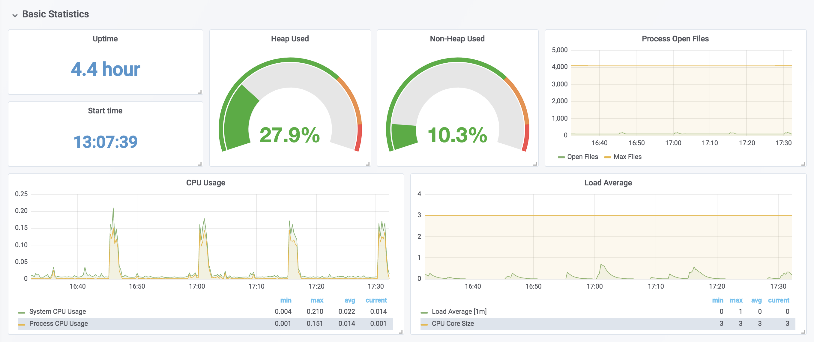

# Application observability and maintenance(15%)

## Objectives

* Understand API deprecations
* Implement probes and health checks
* Use provided tools to monitor Kubernetes applications
* Utilize container logs
* Debugging in Kubernetes


# Application Troubleshooting

## Objectives

* Understand and use the troubleshooting flow.
* Monitor applications.
* Review system logs.
* Review agent logs.
* Discuss conformance testing.
* Discuss cluster certification.

## Overview

K8s is sensitive to network issues. To troubleshoot our claster we may need to

* deploy a pod with a shell(`bash` for example) available - like busybox.
* DNS configuration files and tools like `dig` are a good place for start. 
* For more difficult challenges, we may need to install other tools like `tcpdump`.

Large and diverse workloads can be difficult to track, so monitoring of usage is essential. These features have not been ingested into K8s, so exterior tools will be necessary, such as [Prometheus](https://www.prometheus.io/). Prometheus provides a time-series database, as well as integraiton with Grafana for visulalization and dashboards.

Logging activity accross all the nodes is another feature not part of K8s. Using [Fluentd](https://www.fluentd.org/) can be useful data collector for a unified logging layer. Having aggregated logs can help visualize the issues, and provides the ability to search all logs. It's a good place to start when local network troubleshooting does not expose the root cause. 

## Basic Troubleshooting Steps

The trouble shooting flow should start with the obvious. It there are errors from the command line, investigate them first. The symptoms of the issue will probably determine the next step to check. Working from the application running inside a container to the cluster as a whole may be a good idea. The application may have a shell we can use, for example:

```bash
$ kubectl create deployment troubleshoot --image=nginx
$ kubectl exec -ti troubleshoot- -- /bin/sh
```

If the Pod is running, use `kubectl logs pod-name` to view the standard out of the container. Without logs, we may consider deploying a sidecar container in the Pod to generate and handle logging. The next place to check is networking, including DNS, firewalls and general connectivity, using standard Linux commands and tools.

Security settings can also be a challenge. RBAC, covered in the security chapter, provides mandatory or discretionary access control in a granural manner. SELinux and AppArmor are also common issues, especially with network-centric applications.

The issues found with a decoupled system like K8s are similar to those of a traditional datacenter, plus the added layers of K8s controllers:

* Errors from the command line
* Pod logs and state of Pods
* Use shell to troubleshoot Pod DNS and network
* Check node logs for errors, make sure there are enough resources allocated
* RBAC, SELinux or AppArmor for security settings
* API calls to and from controllers to kube-apiserver
* Inter-node network issues, DNS and firewall
* Control plane controllers(control Pods in pending or error state, errors in log files, sufficient resources, etc.).

> **Warning**
> Unlike typical single vendor programs, there is no one organization responsible for updates to k8s. It's because k8s is a high-velocity open source software project.

## Basic Troubleshooting Flow: Pods

Should the error not be seen while staring the Pod, investigate from within the Pod. A flow working from the application running inside a container to the larger cluster as a whole may be a good idea. Some applications will have a shell available to run commands, for example:

```bash
$ kubectl create deployment tester --image=nginx
$ kubectl exec -ti tester- -- /bin/sh
```

A feature which is still in alpha state, and may change in any way or disappear, is the ability to attach an image to a running process. This is very helpful for testing the existing pod rather than a new pod, with different configuration. If`--feature-gates=EmphemeralContainers=true` is not set for the kube-apiserver and kube-scheduler by default, we can get an error:

```bash
$ kubectl alpha debug -h
<output_omitted>

$ kubectl alpha debug registry-6b5bb79c4-jd8fj --image=busybox
error: ephemeral containers are disabled for this cluster
(error from server: "the server could not find the requested resource").
```

Now we can test a different feature. Create a container to understand the view a container has of the node it is running on. Change out the node name, `master` for our master node. Explore the commands we have available.

`kubectl alpha debug node master -it --image=busybox`

On the container:

```bash
/ # ps
....
31585 root   2:00 /coredns -conf /etc/coredns/Corefile
31591 root   0:21 containerd-shim -namespace moby -workdir /var/lib/containe
31633 root   0:12 /usr/bin/kube-controllers
31670 root   0:05 bird -R -s /var/run/calico/bird.ctl -d -c /etc/calico/conf
31671 root   0:05 bird6 -R -s /var/run/calico/bird6.ctl -d -c /etc/calico/co
31676 root   0:01 containerd-shim -namespace moby -workdir /var/lib/containe
31704 root   0:07 /usr/local/bin/kube-proxy --config=/var/lib/kube-proxy/con

/ # df
<output_omitted>
```

* If the pod is running we can use `kubectl logs pod-name` to view the standard out of the container.
* Without logs, we may consider deploying a sidecar container in the Pod to generate and handle logging.
* Check is networking, including DNS, firewalls, and general connectivity, using standard Linux commands and tools.

Troubleshooting and application begins with the application itself. Is the application behaving as expected? Transient issues are difficult to troubleshoot; difficulties in troubleshooting are also encountered if the issue is intermittent, or if we experience occasional slow performance.

Assuming the app is not the issue, we begin by viewing the pods with `kubectl get` commands. 

* Ensure the pods report a status of `Running`. 
* A status of `Pending` typically means a resource is not available from the cluster, such as a properly tainted node, expected sotrage, or enough resources. 

Other error codes typically require looking at the logs and events of the containers for further troubleshooting. Also we can look for an unusual number of restarts. 

A container is expected to restart due to several reasons, such as a command argument finishing. If the restarts are not due to that, it may indicate that the deployed app is having an issue and failing due to panic or probe failure.

View the details of the pod and the status of the containers using the  `kubectl describe pod` command. This will report overall pod status, container configurations and container events. Work through each section looking for a reported error.

Should the reported information not indicate the issue, the next step would be to view any logs of the container, in case there is a misconfiguration or missing resource unknown to the cluster, but required by the application. These logs can be seen with the `kubectl logs <pod-name> <container-name>` command.

## Basic Troubleshooting Flow: Node and Security

Security settings can also be a challenge. 

Disabling security for testing would be a common response to an issue - there could be multiple issues to troubleshoot, so we need to be sure to re-enable security and test the workload again.

Internode networking can also be an issue. Changes to switches, routes, or other network settings can adversely affect K8s. Historically, the primary causes were DNS and firewalls. As K8s integrations have become more common and DNS integration is maturing, this has become less of an issue. Still, check connectivity for recent infrastructure changes as part of our troubleshooting process. 

Every so often, an update which was said shouldn't cause an issue may, in fact, be causing an issue :)

## Basic Troubleshooting Flow: Agents

The issues found with a decoupled system like Kubernetes are similar to those of a traditional datacenter, plus the added layers of K8s controllers:

* Control pods in pending or error state,
* Look for errors in log files
* Are there enough resources?
* etc.

## Monitoring

Monitoring is about collecting metrics from the infrastructure, as well as applications.
Prometheus is part of the CNCF. As a K8s plugin, it allows one to scrape resource usage metrics from Kubernetes objects across the entire cluster. It also has several client libraries which allow us to instrument our application code in order to collect application level metrics.

Collecting metrics is the first step, making use of the data collected is next. We have the ability to expose lots of data points. Graphing the data with a tool like Grafana can allow for visual understanding of the cluster nad application status. 



## Logging Tools

Typically, logs are collected locally and aggregated before being ingested by a search engine and displayed via a dashboard. While there are many software stacks, the Elasticsearch, Logstash, and Kibana Stack has become quite common.

In Kubernetes, the `kubelet` writes container logs to local files (via the Docker logging driver). The `kubectl logs` command allows us to retrieve these logs.

Cluster-wide, we can use `Fluentd` to aggregate logs. 

> **Note**
>Detailed logging concepts description can be found [here](https://kubernetes.io/docs/concepts/cluster-administration/logging/).

Setting up Fluentd for K8s logging is a good exercise in undestading DaemonSets. Fluentd agents run on each node via a DaemonSet, they aggregate the logs and feed them to an Elasticsearch instance prior to visualizaiton in a Kibana dashboard.

## Monitoring Applications

As a distributed system, Kubernetes lacks monitoring and tracing tools which are cluster-aware. Other CNCF projects have started to handle various areas. As they are independent projects, we may find they have some overlap in capability. Some of them are:

* [Prometheus](https://prometheus.io/) focuses on metrics and alerting. Provides a time-series database, queries and alerts to gather information and alerts for the entire cluster. With integration with Grafana, as well as simple graphs and console templates, we can easily visualize the cluster condition graphically.
* [Fluentd](https://www.fluentd.org/) is a unified logging layer which can collect logs from over 500 plugins and deliver to a multitude of outputs. A single, enterprise-wide tool to filter, buffer, and route messages just about anywhere we may want.
* [OpenTracing](https://opentracing.io/) project seems to provie worthwile instrumentation to propagate tracing among all services, code an packages, so the trace can be complete. Its goal is a "single, standard mechanism" for everything.
* [Jaeger](https://www.jaegertracing.io/) tracing system developed by Uber, focused on distributed context propagation, transaction monitoring, and root cause analysis, among other features. This has become a common tracing implementation of OpenTracing.

## System and Agent Logs

Where system and agent files are found depends on the existence of `systemd`. 

Those with `systemd` :

* will log to` journalctl`, 
* this can be viewed with `journalctl -a`.
* unless the `var/log/journal` directory exists, the journal is volatile. 
* As K8s can generate a lot of logs, it would be advisable to configure log rotation, should this directory be created.

Without `systemd`: 

* the logs will be created under `/var/log/<agent>.log`, 
* it's also be advisable to configure log rotation.

## Conformance Testing

The flexibility of Kubernetes can lead to the development of non-conforming cluster:

* meet the demands of our environment
* several vendor-provided tools for conformance testing
* For ease of use, `Sonobuoy by Heptio` can be used to understand the state of the cluster.

With more than 60 known distributions, there is a challenge to consistency and portability. In late 2017, a new program was started by CNCF to certify distributions that meet essential requirements and adhere to complete API functionality:

* Confidence that workloads from one distribution work on others
* Guarantees complete API functions
* Testing and Architecture Special Interest Groups

We can find more about [submitting conformance results](https://github.com/cncf/k8s-conformance/blob/master/instructions.md) on Github


## More resources

Official docs:

* [Troubleshooting](https://kubernetes.io/docs/tasks/debug-application-cluster/troubleshooting/)
* [Troubleshooting Applications](https://kubernetes.io/docs/tasks/debug/debug-application/debug-pods/)
* [Troubleshoot Cluster](https://kubernetes.io/docs/tasks/debug-application-cluster/debug-cluster/)
* [Debug Pods and ReplicationControllers](https://kubernetes.io/docs/tasks/debug-application-cluster/debug-pod-replication-controller/)
* [Debug Services](https://kubernetes.io/docs/tasks/debug/debug-application/debug-service/)

Others:

* [Kubernetes Github resources for issues and bug tracking](https://github.com/kubernetes/kubernetes/issues)
* [Kubernetes Slack channel](https://kubernetes.slack.com/)