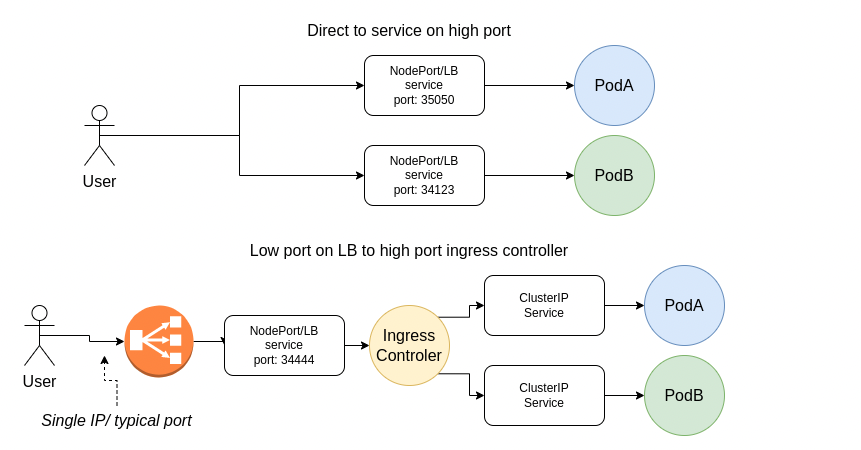
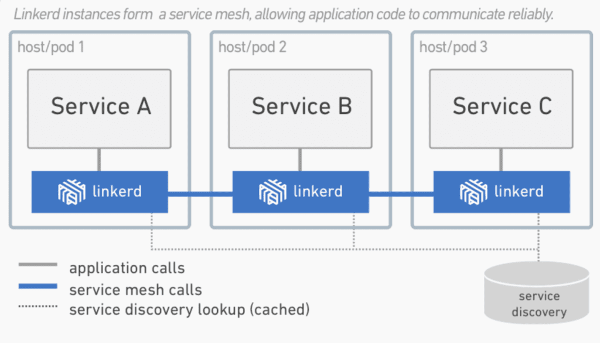
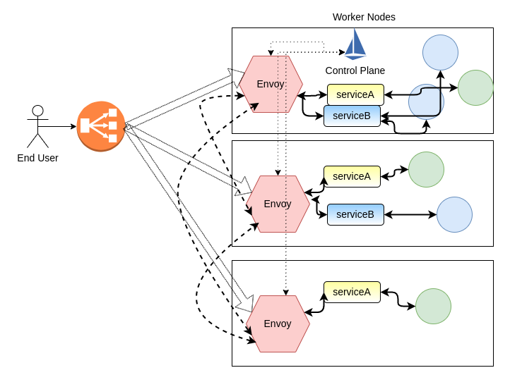

# Services & Networking (20%)

## Objectives

* Demonstrate basic understanding of Network Policies
* Provide and troubleshoot access to applications via services
* Use Ingress rules to expose applications

# Exposing Applications

* Use services to expose an application
* Understand the Cluster IP service
* Configure the NodePort service
* Deploy the LoadBalancer service
* Discuss the ExternalName service
* Understand an ingress controller


## Service Types

* `ClusterIP` - the `ClusterIP` service type is the default, and only provides access internally(except if manually creating an external endpoint). The range of `ClusterIP` used is defined via an API server startup option. The `kubectl proxy` command creates a local service to access a ClusterIP. This can be useful for troubleshooting or development work.

* `NodePort` - the `NodePort` type is great for debugging or when a static IP address is necessary, such as opening a particular address through a firewall. The NodePort range is defined in the cluster configuration.

* `LoadBalancer` - the `LoadBalancer` service was created to pass requests to a cloud provider like GKE or AWS. Private cloud solutions also may implement this service type if there is a cloud provider plugin, such as with CloudStack and OpenStack. Even without a cloud provider, the address is made available to public traffic, and packets are spread among the Pods in the deployment automatically.

* `Externalname` - a newer service is `ExternalName`, which is a bit different. It has no selectors, nor does it define ports or endpoints. It allows the return of an alias to an external service. The redirection happens at the DNS level, not via a proxy or forward. This object can be useful for services not yet brought into the K8s cluster. A simple change of the type in the future would redirect traffic to the internal objects. As CoreDNS has become more stable, this service is not used as much.

## Services Diagram

The `kube-proxy` running on cluster nodes watches the API server service resources. It presents a type of virtual IP address for services other than `ExternalName`. The mode for this process has changed over versions of K8s.

In v1.0, services ran in `userspace` mode as TCP/UDP over IP or Layer 4. In the v1.1 release, the `iptables` proxy was added and became the default mode starting with v1.2.

There is a traffic graph from [Kubernetes documentation](https://kubernetes.io/docs/concepts/services-networking/service/)


In the `iptables` proxy mode:

* kube-proxy monitors the API server for changes in Service and Endpoint objects,

* updates rules for each object when created or removed. 

  

One limitation to the new mode is an inablility to connect to a Pod should the original request fail, so it uses a `Readiness Probe` to ensure all containers are functional prior to connection. This mode allows for up to approx. 5000 nodes. Assuming multiple Services and Pods per node, this leads to a bottleneck in the kernel

Another mode beginning in v1.9 is `ipvs`. While in beta, and expected to change, it works in the kernel space for greater speed, and allows for a configurable load-balancing algorithm, such as round-robin, shorterst expected delay, least connection and several others. This can be helpful for large clusters, much past the previous 5000 node limitation. This mode assumes IPVS kernel modules are installed and running prior to kube-proxy. Clusters built with kubeadm do not enable ipvs by default, but this can be passed during cluster initialization.

The kube-proxy mode is configured via a flag sent during initialization, such as `mode=iptables` and could also be `ipvs` or `userspace`.

## Service Update Pattern

Labels are used to determine which Pod should receive traffic from a service. Labels can be dynamically updated for an object, which may affect which Pods continue to connect to a service.

The default update pattern is for a rolling deployment, where new Pods are added, with different versions of an applications, and due to automatic load balancing, receive traffic along with previous versions of the application.

Should there be a difference in applications deployed, such that clients would have issues communicating with different versions, we may consider a more specific label for the deployment, which includes a version number. When the deployment creates a new replication controller for the update, the label would not match. Once the new Pods have been created, and perhaps allowed to fully initialize, we would edit the labels for which the Service connects. Traffic would shift to the new and ready version, minimizing client version confusion.

## Accessing Application with a Service

The basic step to access a new service is to use `kubectl`

```bash
$ kubectl expose deployment/nginx --port=80 --type=NodePort
$ kubectl get svc
NAME         CLUSTER-IP   EXTERNAL-IP   PORT(S)        AGE 
kubernetes   10.0.0.1     <none>        443/TCP        18h
nginx        10.0.0.112   <none>        80:31230/TCP   5s

$ kubectl get svc nginx -o yaml
```
```yaml
apiVersion: v1
kind: Service
...
spec:
    clusterIP: 10.0.0.112
    ports:
    - nodePort: 31230
...
Open browser http://<Public IP>:31230
```

The `kubectl expose` command:

* created a service for the nginx deployment. 

* the service used port 80

* generated a random port on all the nodes. 

A particular `port` and `targetPort` can also be passed during the object creation to avoid random values. The `targetPort` defaults to the port, but could be set to any value, including a string referring to a port on a backend Pod. Each Pod could have a different port, but traffic is still passed via the name. Switching traffic to a different port would maintain a client connection, while changing versions of software, for example.

The `kubectl get svc` command gave us a list of all the existing services, and we saw the nginx service, which was created with an internal cluster IP.

The range of cluster IPs and the range of ports used for the random `NodePort` are configurable in the API server startup options.

Services can also be used to point to a service in a different namespace, or even a resource outside the cluster, such as legacy applicatoin not yet on k8s.

## Service Without a Selector

Typically, a service creates a new endpoint for connectivity. Should we want to create the service, but later add the endpoint, such as connecting to a remote database, we can use a service without selectors. This can be used to direct the service to another service, in a different namespace or cluster.

## ClusterIP

For inter-cluster communication, frontends talking to backends can use CliusterIPs. These addresses and enpoints only work within the cluster.

ClusterIP is the default type of service created.

```yaml
spec:
  clusterIP: 10.108.95.67
  ports:
  - name: "443"
    port: 443
    protocol: TCP
    targetPort: 443 
```

## NodePort

NodePort is a simple connection from a high-port router to a ClusterIP using iptables, or ipvs in newer versions. The creation of a NodePort generated a ClusterIP by default. Traffic is routed from the NodePort to the ClusterIP. Only high ports can be used, as declared in the source code. the NodePort is accessible via calls to `<NodeIP>:<NodePort>`.

```yaml
spec:
  clusterIP: 10.97.191.46
  externalTrafficPolicy: Cluster
  ports:
  - nodePort: 31070
    port: 80
    protocol: TCP
    targetPort: 8000
  selector:
    io.kompose.service: nginx
  sessionAffinity: None
  type: NodePort
```

## LoadBalancer

Creating a `LoadBalancer` service generates a `NodePort`, which creates a `ClusterIP`. It also sends an asynchronous call to an external load balancer, typically supplied by a cloud provider. The `External-IP` value will remain in a `<Pending>` state until the load balancer returns. Should it not return, the `NodePort` created acts as it would be otherwise.

```
Type: LoadBalancer
loadBalancerIP: 12.45.105.12
clusterIP: 10.5.31.33
ports:
- protocol: TCP
  Port: 80
```

The routing of traffic to a particular backend pod depends on the cloud provider in use.

## ExternalName

The use of `ExternalName` service, which is a special type of service without selectors, is to point to an external DNS server. Use of the service returns a `CNAME` record. Working with the `ExternalName` service is handy when using a resource external to the cluster, perhaps prior to full integration.

```
spec:
  Type: ExternalName
  externalName: ext.db.example.com
```

## Ingress Resource

An ingress resource is an API object containing a list of rules matched against all incoming requests. Only HTTP rules are currently supported. In order for the container to direct traffic to the backends, the HTTP request must match both the host and the path declared in the ingress.

## Ingress Controller

The use of an ingress controller manages ingress rules to route traffic to existing services. Ingress can be used for fan out to services, name-based hosting, TLS, or load balancing. As a security has become more of a concern, ingress controller pods are no longer given access to low-numbered ports. Instead the assumption is a single high-numbered port, with an external load balancer in use to provide typical low-numbered ports.

There are several ingress controllers such as **nginx** used everywhere, and GCE embedded into a cloud provider. **Traefik** and **HAProxy** are in common use as well. More controllers are available, as is support for more HTTPS/TLS modes, combining L4 and L7 ingress and requesting name or IP via claims. General searching or looking at [Artifact Hub](https://artifacthub.io/) for Helm charts can be useful.

Ingress Controller vs Multiple NodePorts:



## Service Mesh

For More complex connections or resources such as service discovery, rate limiting, traffic management and advanced metrics, we may want to implement service mesh.

A service mesh consists of edge and embedded proxies communicating with each other and handling traffic based on rules from a control plane. Various options are available, for example:

* [**Envoy**](https://www.envoyproxy.io/) - it's a modular and extensible proxy favored due to modular construction, open architecture and dedication to remaining unmonetized. Often used as a data plane under other tools for a service mesh.
* [**Istio**](https://istio.io/) - it's a powerful tool set which leverages Envoy proxies via a multi-component control plane. Built to be platform independent it can be used to make the service mesh flexible and feature filled.
* [**Linkerd**](https://linkerd.io/) -  it's another service mesh purpose built to be easy to deploy, fast, and ultralight.

A service mesh can be deployed in several different ways, just as the rest of Kubernetes. Here is an example of one way Linkerd may be deployed(from linkerd.io website) and a possible example of Istio.



Example of Istio Service Mesh:



