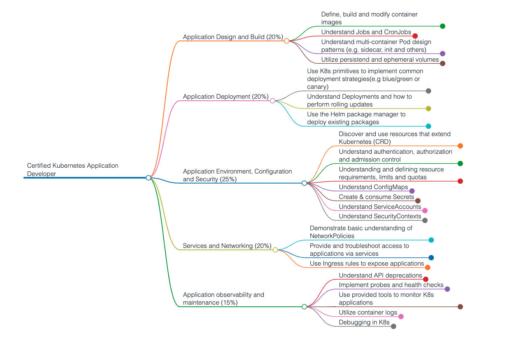

# CKAD preparation notes
Preparation notes for the Certified Kubernetes Application Developer (CKAD) exam.



## Table of contents

0. [Kubernetes Architecture](00_kubernetes_architecture.md) 
1. [Application Design & Build](01_application_design_and_build.md) 
2. [Application Deployment](02_application_deployment.md) 
3. [Application Observability & Maintenance(troubleshooting)](03_application_observability_and_maintenance.md) 
4. [Application Environment, Configuration & Security](04_application_environment_configuration_and_security.md) 
5. [Services & Networking(exposing applications)](05_services_and_networking.md) 


## Vim config for editing yaml files

> **Note**
> This is configured in the exam environment, but might be helpful to configure it on your local environment when preparing for the exam.

Create file with vim config 
`vim ~/.vimrc`

Add the following lines:
```
set expandtab
set tabstop=2
set shiftwidth=2
```
Explanation:
* `expandtab` - use spaces for tab
* `tabstop` - how many spaces used for tab
* `shiftwidth` - how many spaces are used for indentation


## Useful links

* [Curriculum](https://github.com/cncf/curriculum)
* [Set up multinode cluster using kind](https://mcvidanagama.medium.com/set-up-a-multi-node-kubernetes-cluster-locally-using-kind-eafd46dd63e5)
* [CKAD Exercises](https://github.com/dgkanatsios/CKAD-exercises)

